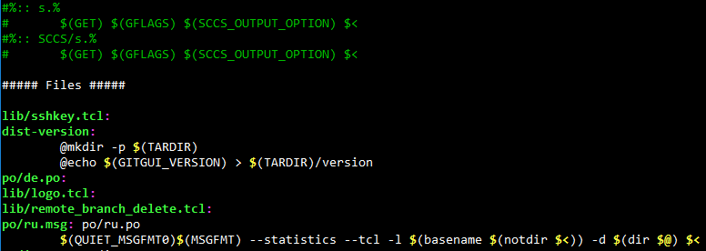

# Tools

Frustrated by the lack of basic tools for Makefile debugging, I started hackily rolling my own.  
(Sorry this is a few eons too late to the Makefile party. I'm a dinosaur.)

- `make-dump.awk`: Pre-processes a Makefile and optionally searches for target by regex. Usage:

		make -n -p | awk -f make-dump.awk [TARGET_PATTERN]

  Note that it's not bulletproof or anything. It's just intended to be a debugging tool. Sample screenshot:  
  
